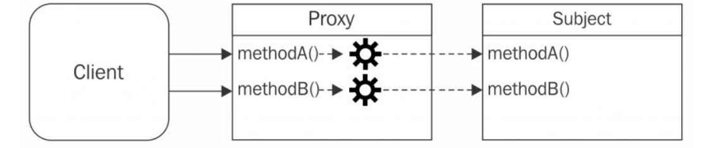

# Nodejs Design Patterns

Design Pattern is a Reusable Solution to Recurring Problem
were Popularized in the 90s by the almost Legendary Gang of Four (GoF)
Split into Three Things Creational, Structural , Behavioral Patterns

### Creational Design Patterns

Creational Design Patterns Solved Alot Of Problems Related to The Creation Of Object
Split into Multiple Patterns

- Factory
- Builder
- Singleton
- Revealing Constructor (Not Related to GoF Patterns)

#### Abstract Factory Design Pattern

- Solved Problem
  1- Decouple the Creation of an Object from Implementation
  2- also can used to Enforce the Encapsulation by Leveraging Closures

What's Meaning By Decouple Creation here ? <br />
like if i want to Refactor Class and add new Classes Will be Dynamically to add new Type<br />
E.G:
Need to Add a Class Handles the Logic Of The Creation of Gif Image<br />
and another one for JPEG Image and so on<br />
if i want to add new Class for Another Different Images and Code Still Clean?<br />
So The Best way to do That is Abstract Factory Pattern<br />

**Abstract Factory Dynamic Class Code Snippet**

```javascript
import { ImageGif } from './imageGif.js';
import { ImageJpeg } from './imageJpeg.js';
import { ImagePng } from './imagePng.js';

function createImage(name) {
  if (name.match(/\.jpe?g$/)) {
    return new ImageJpeg(name);
  } else if (name.match(/\.gif$/)) {
    return new ImageGif(name);
  } else if (name.match(/\.png$/)) {
    return new ImagePng(name);
  } else {
    throw new Error('Unsupported format');
  }
}

const image1 = createImage('photo.jpg');
const image2 = createImage('photo.gif');
const image3 = createImage('photo.png');
```

#### Builder Design Pattern

Builder is Used to Simplifies the Creation of Complex Object
by Providing a Fluent interface allow us to Build Object Step by Step
**The First Question is What's Complex Object and how this Help me ?**
The Complex Object here is Reference to Object that The Creation of it Takes alot of things
Like Takes alot Of Paramters as Input, have a long steps to Create it

##### in The Wild

Builder is Common patterns in JS As **Superagent** Already Uses Builder Pattern
Because Request takes too many Paramters to it as an input [Superagent Builder Source Code ](https://github.com/visionmedia/superagent/blob/40424e62fbf534823b18b64a8f5f0a6680606cbe/src/client.js#L427)

**Builder Code Snippet**

Builder Result Object

```javascript
import { UrlBuilder } from './urlBuilder.js';

const url = new UrlBuilder().setProtocol('https').setAuthentication('user', 'pass').setHostname('example.com').build();
```

Builder Class
Note **return this** it's Related to Chain of Responsibilites we will talk later about this Pattern

```javascript
export class UrlBuilder {
  setProtocol(protocol) {
    this.protocol = protocol;
    return this;
  }

  setAuthentication(username, password) {
    this.username = username;
    this.password = password;
    return this;
  }

  setHostname(hostname) {
    this.hostname = hostname;
    return this;
  }

  setPort(port) {
    this.port = port;
    return this;
  }

  setPathname(pathname) {
    this.pathname = pathname;
    return this;
  }

  setSearch(search) {
    this.search = search;
    return this;
  }

  setHash(hash) {
    this.hash = hash;
    return this;
  }

  build() {
    return new Url(
      this.protocol,
      this.username,
      this.password,
      this.hostname,
      this.port,
      this.pathname,
      this.search,
      this.hash
    );
  }
}
```

#### Singleton Design Pattern

The Purpose of Singleton is to Enforece the Presence of only one instance of class and Centralize it's Access

Use Case:

- Sharing Stateful Information
- Optimize the Resource of Usage
- Synchronize access to Resource
  In The Wild:
  Database Connection Already Using This Pattern
  The Easiest Way to Create Singleton in Nodejs is Just to **Cache the Module**

**Singleton Code Snippet**

```javascript
class Calculator {
  constructor(initialVal) {
    this.initialVal = initialVal;
  }
  increase(val) {
    this.initialVal += parseInt(val);
  }
  total() {
    return this.initialVal;
  }
}
module.exports = new Calculator(0);
```

#### Wiring Modules (This One of the Most Interesting Topics Singleton + Dependency injection)

Every App is The Result of Aggregation of Several Components and App Grows,
the Way we connect these Components Becomses Win Or Lose Factor
For the Maintainability and Success Of The Project<br />
[This Great Quote From Nodejs Design Patterns Book And Most of Code Snippets Also](https://www.packtpub.com/product/node-js-design-patterns-third-edition/9781839214110)

Let's Say we Have A Service(A) >>>>>>>> Service(B)<br />
We want these Services Talks With Each Other and also Reuse These Services in Different Places<br />
So Every time we will Create new Instance From This Service ? <br />
The First Thing Comes in your Mind is to Make It as Singleton
And that's Also what is i was Thinking about at First
But we still have a Problem here is Related to<br />
1- Mock Our Services <br />
2- Let's Say i will change the whole Object Also<br />
these Two Problem Can Solve by **Dependency Injection**<br />
Just Inject The Object to Another Objection Constructor

#### Dependency Injection

Module System with Singleton can Servce as Great Tool for Organizing and Wiring Component Together

but on the other hand they Might Be Tighter Coupling between Components

So Dependency Injection is the Ideal Solution for Wiring Modules Together,
And Solving The Coupling between Modules, and Mock Test Cases

Purpose:

- Solving Thightly Coupled Between Modules
- Mock Services Easily

So Now The Communication Between Services is Become Easy By Using
**Singleton + Dependency Injection**

**Dependency Injection Code Snippet**

```javascript
export class Blog {
  constructor(db) {
    this.db = db;
    this.dbRun = promisify(db.run.bind(db));
    this.dbAll = promisify(db.all.bind(db));
  }
  initialize() {}
  createPost(id, title, content, createdAt) {}
  getAllPosts() {}
}
```

```javascript
import { Blog } from './blog.js';

const db = createDb(join(__dirname, 'data.sqlite'));
const blog = new Blog(db);
```

#### Conclusion

Most of Frameworks already Using these Staff like Nestjs, Laravel,...
by Another Pattern Called Inversion of Control (IOC)
Allows us to Shift the Responsibilites of Wiring
modules to Third Party Package Called (IOC Containers)
One of the Most Interseting Typescript IOC Container is [InversifyJS](https://www.npmjs.com/package/inversify)

### Structural Design Patterns

Structural Design Patterns Are Focused on Prodividing ways To Realize Relationshop between Entites

- Proxy: A Pattern That Allows us to Control Access to Another Object
- Decorator: A Common Pattern to Enhance and Add New Functionality to Existing Object
- Adapter: Allows us to Access the Functionality Of Object Using Different Interface like a Wrapper

#### Proxy Design Pattern

Proxy Pattern Mainly Control Access to Another Object Called **Subject**
The Proxy and Subject Have Identical The Same Interface (E.G Function names)



##### Use Cases

- **Data Validation**: The Proxy Validates the INput Before Forwarding it to the Subject <br />
- **Security**: Proxy Verifies that the Client is Authorized to Perform the functionality <br />
- **Caching**: The Proxy Keeps internal Cache so that the Proxied Operation are executed <br />
- **Logging**: Before Execute the Subject Functionality we can Easily log anything <br />

If You Want Fully Code check Proxy Folder inside **StructuralPatterns**

##### in The Wild

- LoopBack: Framework Using Proxy to intercept and enhance method calls on Controllers & Custom Validation
- Vuejs Version3: Has reimplemented Observable properties using Proxy Pattern

**Proxy Code Snippet**

```javascript
class Calculator {
  divide(dividend, divisor) {
    const result = dividend / divisor;
    return result;
  }
}

class SafeCalculator {
  constructor(calculator) {
    this.calculator = calculator;
  }
  divide(dividend, divisor) {
    if (divisor === 0) {
      throw Error('Division by 0');
    }
    return this.calculator.divide(dividend, divisor);
  }
}
const calculator = new Calculator();
const safeCalculator = new SafeCalculator(calculator);
```

#### Decorator Design Pattern

Structural Design Pattern That Consists in Dynamically Augmenting the Behavior of Existing Object
it's Very Similar to Proxy Design Pattern But There is Some Difference <br />

**Diff Between Proxy & Decorator**
_Decotrator_: Allows to Enhance the Functionality of Existing Object with new Behavior <br />
_Proxy_: is Used to Control the Access to A Concrete or Virtual Object <br />

If You Look at this Picture you will see MethodC() has been added Not Like the same we did at Proxy
there is not New Functionality their


##### Use Cases

One of the most Use Case here if you want to Enhance the Functionality of Existing Object
so After Google Created LevelUp Database Most of Developers Enhanced it and used it in different Senarios
You Can Look at this Repo [Awesome-levelUp-Database](https://github.com/Level/awesome)

If You Want Fully Code check Decorator Folder inside **StructuralPatterns**

**Proxy Code Snippet**

```javascript
class Calculator {
  divide(dividend, divisor) {
    const result = dividend / divisor;
    return result;
  }
}

class EnhancedCalculator {
  constructor(calculator) {
    this.calculator = calculator;
  }
  add(X, Y) {
    return X + Y;
  }
  divide(dividend, divisor) {
    if (divisor === 0) {
      throw Error('Division by 0');
    }
    return this.calculator.divide(dividend, divisor);
  }
}
const calculator = new Calculator();
const enhancedCalculator = new EnhancedCalculator(calculator);
```
